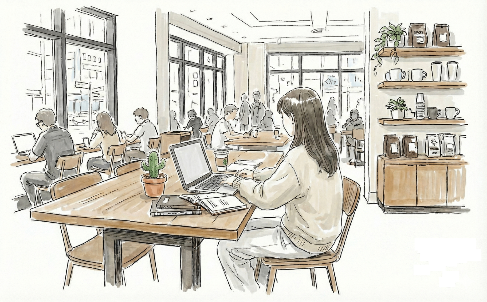

# Window Seat - Website Blocker & Focus Dashboard Chrome Extension

Your digital window seat for deep work. A cozy Chrome Extension that helps you stay focused by blocking distracting websites and offering 40Hz gamma focus audio.



## Features

- 🪟 **Cozy Study Dashboard** - Warm, calming design with animated window view
- ⏱️ **Focus Timer** - Tracks your focus session in real-time with countdown
- 🚫 **Website Blocker** - Block distracting sites during focus sessions
- 🔐 **Shame Phrase Unlock** - Type a phrase to quit early (prevents impulsive exits)
- 🎵 **40Hz Focus Audio** - Gamma frequency audio to enhance concentration
- 🔄 **Optional New Tab Replacement** - Replace your new tab with the dashboard

## Tech Stack

- React 18 + TypeScript
- Vite
- Tailwind CSS
- Framer Motion
- Chrome Extension Manifest V3

## Installation (Development)

1. Clone this repository
2. Install dependencies:
   ```bash
   npm install
   ```
3. Build the extension:
   ```bash
   npm run build
   ```
4. Load the extension in Chrome:
   - Open `chrome://extensions/`
   - Enable "Developer mode"
   - Click "Load unpacked"
   - Select the `dist` folder

## Project Structure

```
├── public/
│   ├── manifest.json      # Chrome extension manifest
│   ├── background.js      # Service worker for blocking
│   ├── blocked.html       # Page shown when accessing blocked sites
│   └── icons/             # Extension icons (add your own)
├── src/
│   ├── components/        # React components
│   ├── hooks/             # Custom hooks
│   ├── pages/             # Page components
│   └── assets/            # Images and static files
├── privacy-policy.md      # Required for Chrome Web Store
└── README.md
```

## Building for Chrome Web Store

1. Build the production version:
   ```bash
   npm run build
   ```

2. Create a ZIP file of the `dist` folder:
   ```bash
   cd dist && zip -r ../cozy-focus.zip .
   ```

3. Upload `cozy-focus.zip` to the [Chrome Web Store Developer Dashboard](https://chrome.google.com/webstore/devconsole/)

## Required Icons

Add these icon sizes to `public/icons/`:
- `icon16.png` (16x16)
- `icon48.png` (48x48)
- `icon128.png` (128x128)

## Permissions Explained

- `storage` - Save blocklist, session state, and preferences locally
- `declarativeNetRequest` - Block websites using Chrome's efficient blocking API
- `alarms` - Manage focus session timers
- `tabs` - Optional new tab replacement feature
- `<all_urls>` - Required to intercept and redirect blocked sites

## Privacy

Window Seat stores all data locally on your device. No browsing history or personal information is sent to external servers. See [privacy-policy.md](./privacy-policy.md) for details.

## License

MIT
